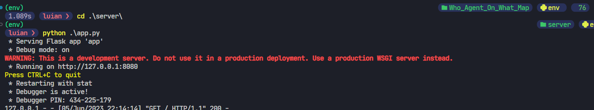
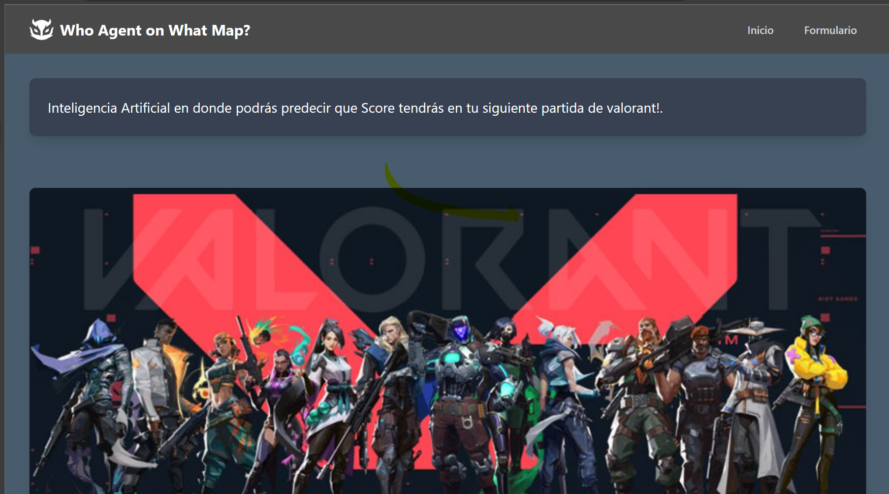
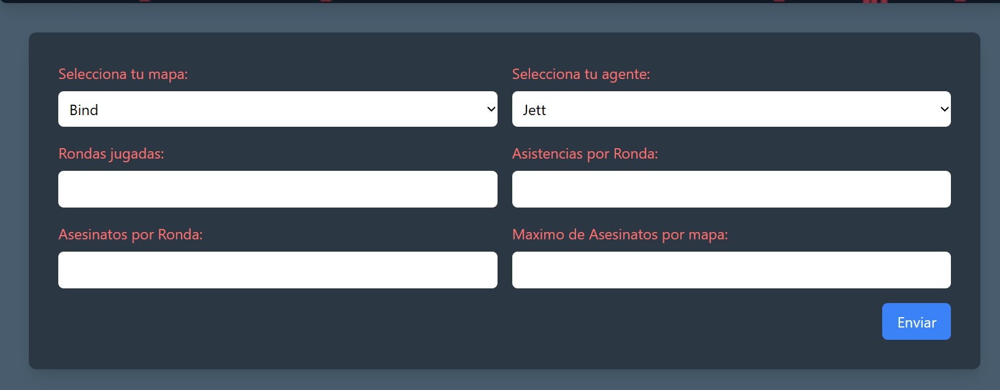
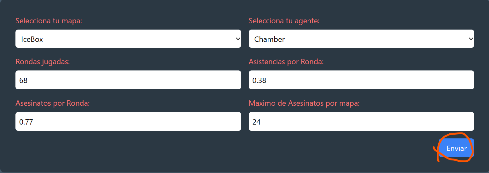
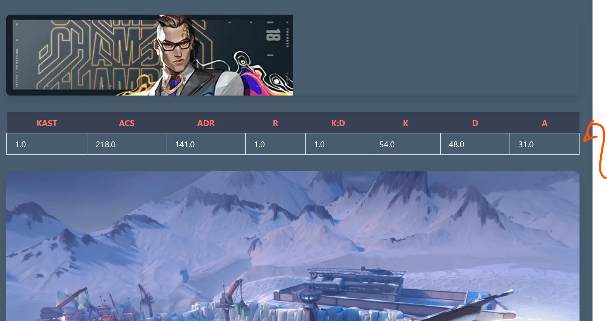

# Prediccion de estadisticas del videojuego de Valorant 

## Pasos para ejecutar el proyecto 

1. Crear un entorno virtual de python
    - En windows
    > python -m venv nombre_entorno
    - Linux y Mac
    > python3 -m venv nombre_entorno
    - Activar el entorno virtual 
    > nombre_entorno\Scripts\activate
    #En linux
    > source nombre_entorno/bin/activate
2. Instalar los paquedes/dependencias del proyecto
    Windows, Linux o Mac
    > pip install requirements.txt
    > pip3 install requirements.txt

Una vez instaladas las dependencias procedemos a ejecutar los Scripts, esto es facil ya que se encuentran en Jupyter Notebooks, por lo cual facilita su ejecucion.
- El primero es el notebook llamado [**scraping.ipynb**](scraping.ipynb) el cual extrae y almacena los datos en una BD NoSQl de MongoDB, este tarda al redededor de 15 minutos en finalizar su ejecucion.
- Una vez finalizado, continuamos con el notebook llamado [**pandas.ipynb** ](pandas.ipynb), el cual contiene todo la carga, analisis, pre-procesamiento, entrenamiento de nuestro modelo y resultado de prediccion. 
- Despues nos moveremos a la carpeta  **server** sin salirnos del entorno virtual
    > cd ./server

Una vez dentro de la carpeta server ejecutaremos el siguiente comando para levantar nuestro servidor de Flask
    > python app.py

Accedemos a la url de nuestro servidor y nos mostrala la siguiente app web

Vamos a la parte del formulario 

Llenamos el formulario con datos, se recomienda basarse en los datos de [www.vlr.gg/stats](https://www.vlr.gg/stats) para hacer un llenado correcto de los datos solicitados

Una vez llenado presionamos el boton enviar, lo cual nos llevara a la vista de nuestra prediccion.

Para ver las imagenes ir a la carpeta [images](/images/)

